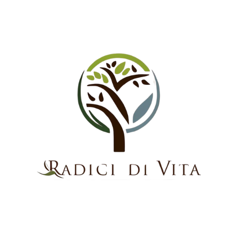

# Radici Di Vita

 "Radici Di Vita" (Roots of Life) is a web application uniquely designed for memorialization, emphasizing themes of life, growth, and connection to nature. This project offers a serene and respectful online space for remembrance, aligning perfectly with a brand identity centered on natural beauty and enduring memory rather than traditional funeral services.

## Table of Contents

1.  [About the Project](#1-about-the-project)
2.  [Features](#2-features)
3.  [Technologies Used](#3-technologies-used)
4.  [Live Website Access](#4-live-website-access)
5.  [Project Structure](#5-project-structure)
6.  [Local Installation](#6-local-installation)
7.  [Contributions](#7-contributions)
8.  [License](#8-license)
9.  [Contact](#9-contact)

---

## 1. About the Project

The "Radici Di Vita" website provides an intuitive and aesthetically pleasing platform for individuals seeking a commemorative approach that resonates with nature and the continuity of life. It focuses on creating a space where memories can flourish and endure, honoring the departed in an organic and meaningful way.

## 2. Features

* **Responsive Design:** Optimized for seamless viewing across various devices (mobile, tablets, desktops).
* **Intuitive Navigation:** Clear sections for "Concetto" (Concept), "Vantaggi" (Benefits), "Abbonamenti" (Subscriptions), and "Contatti" (Contact/Sign Up).
* **Custom Font Integration:** Utilizes Google Fonts to provide an aesthetic typography that complements the natural theme.
* **Favicons/App Icons:** Includes `apple-touch-icon.png` and `android-chrome-*.png` for a consistent user experience on mobile devices.

## 3. Technologies Used

* **Frontend:**
    * HTML5
    * CSS3 (`style.css` and `queries.css` for responsiveness)
    * Google Fonts
* **Backend (Inferred from `url_for` usage, typical of Flask/Jinja):**
    * Python
    * Flask (Python web framework)

## 4. Live Website Access

You can access the deployed version of "Radici Di Vita" via the following link:

[**Access Radici Di Vita**](YOUR_RENDER_URL_HERE)
*(Please replace `YOUR_RENDER_URL_HERE` with the actual URL of your Render deployment.)*

## 5. Project Structure

The general project structure (based on the provided HTML and common Flask conventions) should be similar to:
